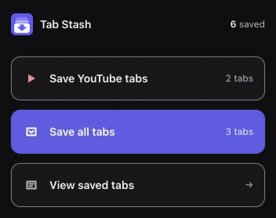
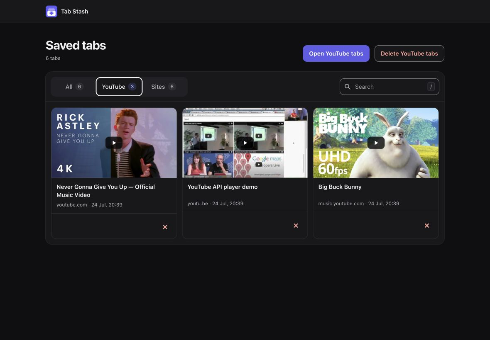
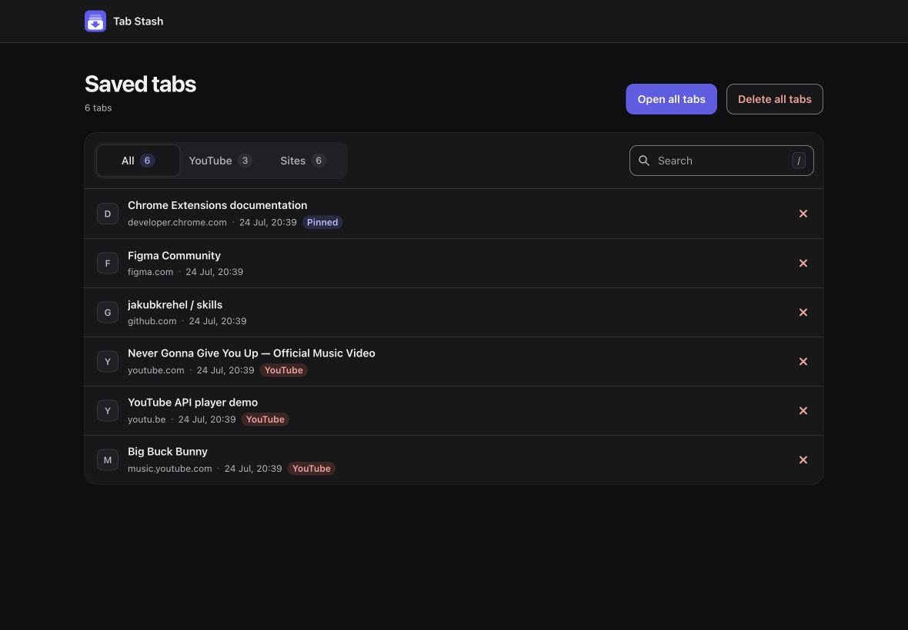

# Tab Stash

A small Manifest V3 Chrome extension that saves open tabs locally and closes
them only after the save succeeds.

## Preview







## What it does

- **Save YouTube tabs** saves and closes YouTube, YouTube Music, `youtu.be`,
  and privacy-enhanced YouTube tabs across all regular browser windows.
- **Save all tabs** saves every restorable web tab across all regular windows.
  YouTube tabs always go into the separate YouTube collection.
- **View saved tabs** shows a library with **All**, **YouTube**, and **Sites**
  views, where you can search, open or delete individual tabs, and use bulk
  actions.
- The **YouTube** view shows lazy-loaded video thumbnails; playlist, channel,
  and other non-video pages use a neutral fallback card.
- Pinned state and original tab order are saved. Opening a saved tab keeps the
  saved copy. Deleting a saved tab always requires confirmation.
- Browser-internal pages such as `chrome://settings` are left open because an
  extension cannot safely restore them.

## Install locally

1. Open `chrome://extensions` in Chrome.
2. Turn on **Developer mode**.
3. Click **Load unpacked**.
4. Select this `tab-stash` folder.
5. Pin **Tab Stash** from Chrome's extensions menu.

Chrome shows a browsing-history permission warning because the `tabs`
permission is required to read the titles and URLs of all open tabs. The
extension has no host permissions, analytics, or remote code. Opening the
YouTube view loads thumbnail images directly from YouTube's image host; saved
tab data remains local to this Chrome profile and is removed if the extension
is uninstalled.

## Development checks

Run the dependency-free test suite:

```sh
npm test
```

The tests cover exact YouTube hostname classification, protected URL handling,
collection separation, metadata preservation, the persist-before-close
data-safety invariant, and serialized save/delete mutations.

## Icon

The icon is a custom full-bleed vector designed to stay legible at Chrome's
16 px toolbar size. The editable source is in `icons/icon-source.svg`; matching
16, 32, 48, 128, and 1024 pixel PNG assets are included.

Design notes are saved in [`ICON_PROMPT.md`](ICON_PROMPT.md).

## Permissions

- `tabs`: read tab URL/title metadata and close or reopen selected tabs.
- `storage`: persist the two local collections.
- `favicon`: display Chrome's cached favicons in the storage page.

Built against the official Chrome documentation for the
[Tabs API](https://developer.chrome.com/docs/extensions/reference/api/tabs),
[Storage API](https://developer.chrome.com/docs/extensions/reference/api/storage),
and [favicon endpoint](https://developer.chrome.com/docs/extensions/how-to/ui/favicons).
